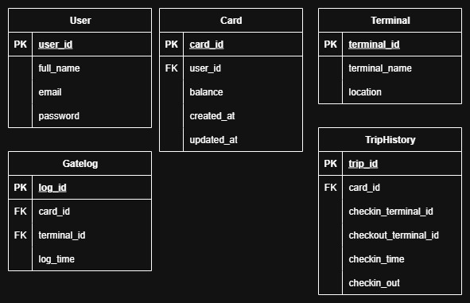

# eticket-backend

## System Design

Anda diminta untuk merancang sebuah sistem E-Ticketing Transportasi Publik yang beroperasi 24 jam, dimana tarif ditentukan berdasarkan titik terminal ketika checkin dan titik terminal ketika checkout. Untuk titik terminal ada 5 dan mempunyai gate/gerbang validasi yang terhubung pada server (bisa 1 atau lebih). Pembayaran dilakukan menggunakan kartu prepaid (seperti pada tol) yang mampu berjalan saat offline.

### 1. Gambarkan desain rancangan anda

+-------------------+        +---------------------+        +-------------------+
| Terminal A (Gate) |<----->|      Server/API     |<-----> | Terminal E (Gate) |
|   Validator       |        |  (Central Backend)  |        |   Validator       |
+-------------------+        +---------------------+        +-------------------+
        |                                                        |
        |                                                        |
        v                                                        v
+-------------------+        +---------------------+        +-------------------+
|  Kartu Prepaid    |<----->| Reader/Encoder Unit |<-----> |  Kartu Prepaid    |
|   (RFID/NFC)      |        |  (On gate machine)  |        |   (RFID/NFC)      |
+-------------------+        +---------------------+        +-------------------+

### 2. Ceritakan rancangan anda dengan jelas saat ada jaringan internet

Alur Check-in:
* Penumpang menempelkan kartu pada gate Terminal A.
* Gate membaca saldo dan ID kartu, lalu mengirim data ke server.
* Server mencatat data check-in (waktu, lokasi terminal, ID kartu).
* Gate membuka bila saldo mencukupi.

Alur Check-out:
* Penumpang menempelkan kartu pada gate Terminal E.
* Server membaca data check-in dari database dan menghitung tarif.
* Server mengurangi saldo kartu sesuai tarif dan mencatat data transaksi.
* Gate membuka jika transaksi berhasil.
  
### 3. Ceritakan solusi anda dengan jelas (apabila memungkinkan) saat tidak ada jaringan internet

Solusi Offline:
* Gate memiliki penyimpanan lokal (misal: SQLite atau file JSON terenkripsi).
* Kartu prepaid menyimpan data minimum: saldo + lokasi & waktu check-in.

Alur Check-in Offline:
* Gate membaca saldo kartu.
* Menyimpan data check-in (terminal, waktu) ke dalam kartu dan penyimpanan lokal gate.
* Validasi saldo lokal → jika cukup, saldo sementara dikurangi, gate terbuka.

Alur Check-out Offline:
* Gate membaca data check-in dari kartu.
* Menghitung tarif berdasarkan data lokal (jarak terminal).
* Mengurangi saldo kartu secara sementara.
* Mencatat transaksi ke log lokal.

Sinkronisasi Saat Online:
* Data transaksi offline dikirim ke server saat koneksi kembali.
* Server melakukan sinkronasi:
* Validasi ulang transaksi.

## Database Design

